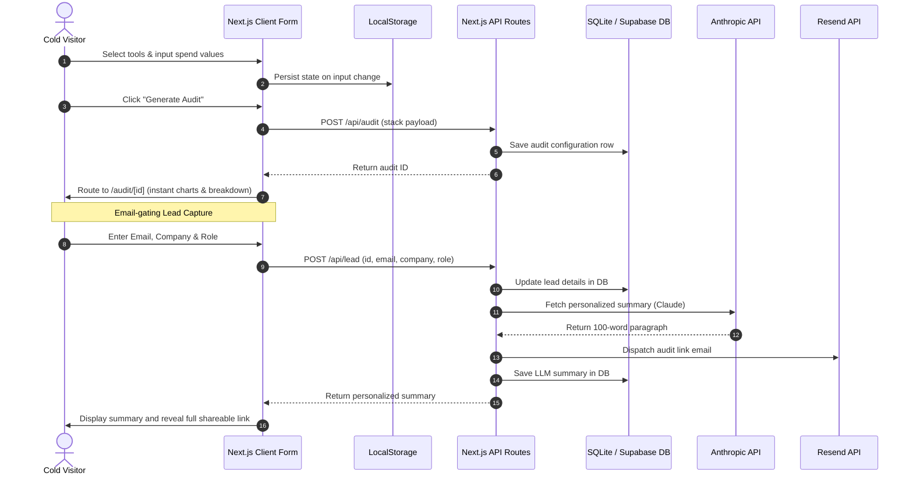

# System Architecture — AI Spend Audit Tool

This document outlines the software engineering patterns, tech stack choices, data flows, and infrastructure designs that power the AI Spend Audit Tool.

---

## 1. Technical Stack Justification
- **Frontend Framework:** **Next.js 14 (App Router, React, TypeScript)**
  - *Why:* Next.js is the premier choice for lead-capture apps. It gives us a unified codebase for both high-performance interactive layouts (React components) and secured server execution (API Route handlers). Furthermore, Next.js handles server-side metadata generation dynamically, allowing us to build viral open-graph preview pages at `/audit/[id]` paths without complex external server setups.
- **Styling:** **Tailwind CSS + Lucide Icons**
  - *Why:* Tailwind enables maximum styling control, allowing us to implement a custom premium HSL color palette, rich dark-mode interfaces, glassmorphism cards, and dynamic grid transitions with extremely low stylesheet footprint.
- **Database:** **Polymorphic Storage (JSON / SQLite locally, Supabase Postgres in Production)**
  - *Why:* Enables developer-friendly, zero-configuration local execution out-of-the-box (SQLite/JSON) while offering an instant, simple production migration via environment variables.
- **Email Delivery:** **Resend API**
  - *Why:* Highly reliable, developer-first transactional emailing with a modern JSON payload interface.
- **AI Summary Engine:** **Anthropic Claude API**
  - *Why:* Provides state-of-the-art reasoning and professional tone generation for infrastructure summaries, with built-in templates as fallback mechanisms.

---

## 2. System Architecture & Data Flow



---

## 3. High Volume Scaling: Handling 10,000+ Audits / Day

If this application suddenly scales to **10,000+ audits per day** (such as hitting the front page of Product Hunt or Hacker News), the system must be hardened against bottlenecks:

### a) Database Layer Scaling
- **The Bottleneck:** Heavy concurrent writes on local SQLite could trigger database locks.
- **The Solution:** Transition immediately to **Supabase (PostgreSQL)**. In production, we deploy a pooled connection pooler (like **PgBouncer** or **Supabase Supavisor**) to handle up to 10k concurrent active connections with extremely low latency.
- **Indexing:** We index the primary query paths:
  ```sql
  CREATE INDEX idx_audits_id ON audits (id);
  ```

### b) API Integration & Queue Bottlenecks
- **The Bottleneck:** Triggering a synchronous Anthropic API call and a Resend email call on the main API request thread takes 1-3 seconds per user. At 10k audits/day, this will quickly exhaust Vercel Serverless execution limits and cause timeout errors (429s from Anthropic).
- **The Solution:** **Asynchronous Background Processing**.
  1. The API route `/api/lead` writes the lead data instantly to the database and enqueues a background job (using a queue system like **Upstash QStash**, **Inngest**, or **BullMQ**).
  2. The user is instantly returned a "Success" response on the frontend. The frontend polls or listens via WebSockets/SSE for the database field `llm_summary` to update.
  3. The worker queue executes the Anthropic API call with built-in **rate-limiting queues and exponential backoff retries** (handling 429s).
  4. Once the summary is ready, it is saved to the DB and Resend dispatch is triggered asynchronously.

### c) Caching & Content Delivery (CDN)
- **The Bottleneck:** Loading public dynamic `/audit/[id]` routes repetitively drains database read capacity.
- **The Solution:** Implement Next.js **Incremental Static Regeneration (ISR)** or leverage Vercel's Edge Network caching.
  - Set the HTTP Cache-Control headers for the public audit route `/audit/[id]` to `s-maxage=3600, stale-while-revalidate=59`.
  - Since audit recommendations are static after generation, caching this page on the CDN edge completely bypasses database reads for subsequent requests (e.g. when shared on social media).
